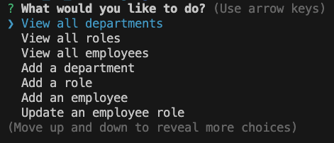
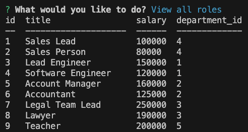

# employee_tracker_cms

## Description

A command-line application that manages a company's employee database. This project helps the user keep track of employees, departments, and roles via tables. Each table has the option to be added to and if an employee needs to update their role, the user can do that. Through this program I clearned how to use mySQL to create, update, and display tables within the command line and thorugh code. I also used Inquirer to gather data from the user to be inserted into the the database.

## Table of Contents

- [Installation](#installation)
- [Usage](#usage)
- [Credits](#credits)
- [License](#license)

## Installation

To run this program the user will need to copy the files to their local machine and open the terminal. Once in the terminal the user will run the command "node server" to launch the program. The user will be presented with options that they can navigate between to decide the action they would like to take.

## Usage

Once the user has downloaded the files they will run the command "node server" and follow the on screen prompts to view, add and update the database.

- GitHub Repo: https://github.com/ahgeak/employee_tracker_cms
- Video of Program: https://drive.google.com/file/d/1cg5aJa3tcANclnAqoaopsmqxHV2zj9xU/view  

Program Images:

## Credits

I attended a tutoring session to understand the queries needed for this project

## License

This project uses an MIT license
